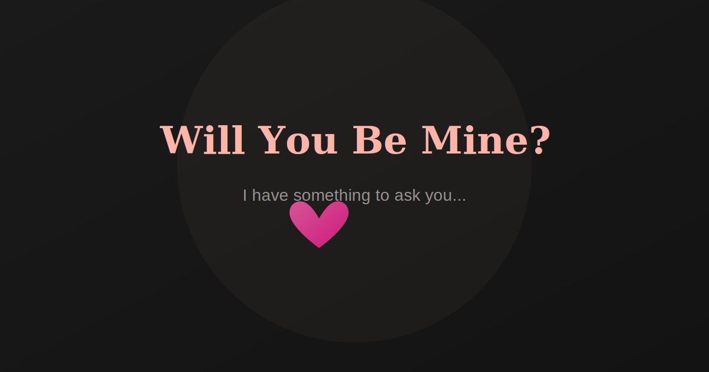

# Valentine 💖 — A Special Question

An interactive, beautifully crafted proposal experience. A dark-themed, romantic single-page app with smooth animations, a runaway "no" button, and a confetti celebration — ready to pop the question.

> Built with **React 19**, **Framer Motion 12**, **Tailwind CSS v4**, and **Vite 8**.



---

## ✨ Features

- **Dark & romantic** — Glassmorphism card, spotlight glow, floating particles
- **Playful interaction** — The NO button runs away on hover; the YES button triggers confetti
- **Celebration mode** — 50-particle confetti burst, animated hearts, spring-loaded success modal
- **Responsive** — Works beautifully on desktop, tablet, and mobile
- **Accessible** — Screen-reader friendly, reduced-motion support, semantic HTML

---

## 🚀 Quick Start

```bash
# Install dependencies
cd proposal-app && npm install

# Start dev server (with HMR)
npm run dev

# Build for production
npm run build

# Preview production build
npm run preview
```

Then open `http://localhost:5173` in your browser.

---

## 🌐 Deploy to Vercel

This project is ready for one-click deploy on Vercel:

[](https://vercel.com/new/clone?repository-url=https://github.com/YOUR_USERNAME/valentine&root-directory=proposal-app)

**Or manually:**
```bash
# Vercel reads vercel.json at repo root and builds from proposal-app/
npx vercel --prod
```

> **Note:** If deploying via Git import, set **Root Directory** to `proposal-app/` in your Vercel project settings (Settings → General → Root Directory).

---

## 📁 Project Structure

```
valentine/
├── proposal-app/              # Main React application
│   ├── src/
│   │   ├── components/
│   │   │   ├── ProposalHero.jsx     # Main page with buttons & modal
│   │   │   ├── Confetti.jsx          # Confetti burst on "yes"
│   │   │   └── FloatingParticles.jsx # Ambient background particles
│   │   ├── App.jsx
│   │   ├── main.jsx
│   │   └── index.css                # Tailwind v4 + custom theme
│   ├── public/
│   │   ├── favicon.svg               # Heart icon
│   │   └── og-image.svg              # Social preview image
│   ├── index.html
│   └── package.json
├── vercel.json                # Vercel deployment config
├── index.html                 # Root redirect → built app
└── README.md
```

---

## 🎨 Customization

Edit `ProposalHero.jsx` to change:
- **Messages** — The heartfelt text and proposal lines
- **Button texts** — The NO button's playful escape messages
- **Colors** — Edit `index.css` `@theme` block or inline gradients
- **Confetti** — Adjust count, duration, colors in `Confetti.jsx`

---

## 📜 License

MIT — made with love, share freely.

---

*Inspired by the joy of asking someone special.* 💕
